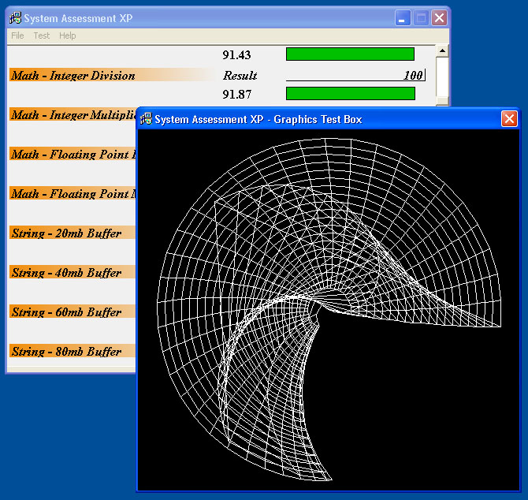

## System Assessment XP

### Description

System Assessment XP is an easy way to compare different computers performances to each other, the program performances tests in a variety of different areas(Maths, Graphics, System...), and then displays the results in an easy to read graphs. The tests are benchmarked against my pc as a deault(AMD XP Barton 3000+, 512mb Ram, Radeon 9800 Pro 128mb Graphics) The test should be carried out on Windows XP as other OS's can provide different results.
 
### More Info
 

             |
---                |---
**Submitted On**   |2004-03-23 21:35:10
**By**             |[Kevin Pfister](https://github.com/Planet-Source-Code/PSCIndex/blob/master/ByAuthor/kevin-pfister.md)
**Level**          |Intermediate
**User Rating**    |4.3 (13 globes from 3 users)
**Compatibility**  |VB 6\.0
**Category**       |[Miscellaneous](https://github.com/Planet-Source-Code/PSCIndex/blob/master/ByCategory/miscellaneous__1-1.md)
**World**          |[Visual Basic](https://github.com/Planet-Source-Code/PSCIndex/blob/master/ByWorld/visual-basic.md)
**Archive File**   |[System\_Ass1726043292004\.zip](https://github.com/Planet-Source-Code/kevin-pfister-system-assessment-xp__1-52727/archive/master.zip)

